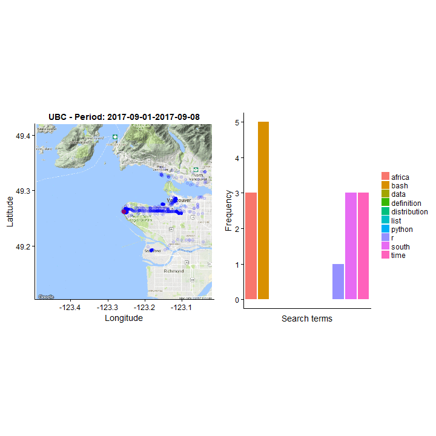

# Google Data Analysis

The main objective of *Google Data Analysis* is to provide a personal data analytics tool to any Google user. Google captures a massive amount of personal information for every person with a Google account. Google data ranges from browser history, location data, YouTube data, and much more. This analytics tool allows any person, with or without coding experience, to analyze personal information as captured by Google and potentially make a few interesting conclusions.



## Data

Sample browser history and location datasets are provided in the repository.

However, if you are interested in this analysis, it is encouraged that you download your own personal Google datasets and use it as replacement for the sample datasets. Visit [Personal Google Data](https://takeout.google.com/settings/takeout) to download your data.

The current aim is to build the analytics tool around location data and browser history data. When a working analytics tool has been built around this data, the goal is to expand to other personal Google datasets.

### Location data

Location data is provided in JSON format with a number of attributes.

* **Timestamp:** A timestamp is provided to identify when a location was captured.

* **Longitude:** Longitudinal coordinate for captured location.

* **Lattitude:** Latitudinal coordinate for captured location.

* **Accuracy:** Accuracy distance of the captured location.

* **Altitude:** Distance above sea level of the captured location.

### Browser history data  

Browser history data is provided in JSON format with a number of attributes.

* **Icon URL:** Location of the icon used for the URL.

* **Page Transition:** How the page was accessed.

* **Title:** Title of the page visited.

* **Client ID:** ID of the person who visited the page.

* **Timestamp:** Timestamp for when the page was visited.

## Analysis Questions

As the analytics tool grows, more questions will be added to the list below.

1. Is there a correlation between a Google user's browsing history topics and location?

## Analysis Hypothesis

Each of the analysis questions above can be investigated by testing a given hypothesis. The hypotheses below relate to the questions above.

1. A Google user's browser history is dependent on his/her location due to having different interests when in different locations.

## Output

Every analysis done during hypothesis testing needs to be communicated in a simple and effective manner. The following general steps will be followed:

**Hypothesis: A Google user's browser history is dependent on his/her location due to having different interests when in different locations.**

1. Convert browser history and location JSON files into tables by importing it into R using the R package called `rjson`.

2. Remove unnecessary data from both datasets by limiting data, such as the amount of locations being captured per second, and removing columns that will not be used, such as Icon URL in browser history.

3. Remove information that does not fall within the analysis. If the datasets do not have the same time ranges, limit the time range limits so that the data can be joined.

4. Merge datasets by timestamps. To map browser history to location, we need to take the time of browser history and location into account. We need to make sure that we know which URL's were visited in which locations.

5. Generalize time periods so that locations and browser history can be grouped per week, for instance.

6. Use natural language processing to find general topics that were browsed.

6. Visualise personal location data on map. The `tidyverse` R package provides sufficient resources to generate maps and visualise location data as points on top of it.

7. Use aesthetics, such as colour and size of points to visualise which were the most popular topics browsed per location.

## How to use

### Method 1: Docker

If you do not want to run the entire analysis locally (possibly due to not having the environment set up on your local machine), the easiest way of running the analysis is by using Docker.

If you have Docker installed, you can run the following command to download the image. This will download the environment that you need to run the analysis, together with the analysis code.

```
docker pull johannesharmse/google
```

1. Clone the repository to a local directory. You can run `git clone https://github.com/johannesharmse/Google-Data-Analysis.git` in your command prompt or bash to store this repository locally.

2. It is encouraged that you use your own personal data for this analysis. As a last resort, the scripts will use the repository sample data for the analysis. Go to [Personal Google Data](https://takeout.google.com/settings/takeout) and follow the instructions on how to download your data. The following two datasets need to be downloaded:

  * Chrome: BrowserHistory.json
  * Location History: Location History.json

3. After downloading the data, paste the two downloaded folders (Chrome and Location History) in the data folder of the cloned repository.

4. Before running the scripts, you might want to alter visualisation arguments. Open `src/data_visualization.R` to specify arguments. When opening the file, scroll to the bottom of the script and change the arguments of the `saveHTML` function to your liking. This is where you can change the location, zoom factor and time frequency of plots. Save and close the file after changing the arguments.

4. Navigate to the `src` folder and run the scripts in the sequence below:

  - `data_import.R`
  - `data_cleaning.R`
  - `data_visualization.R`
  - `report_render.R`

5. To see the files that you might be interested in, go to the `results` folder to find all the generated files. The most comprehensive file is `Google_Data_Analysis_Report.html`. Open the file in one of your local browsers to see the results of the analysis.

## How to contribute

[CONTRIBUTING](https://github.com/johannesharmse/Google-Data-Analysis/blob/master/CONTRIBUTING.md)

## License

[LICENSE](https://github.com/johannesharmse/Google-Data-Analysis/blob/master/LICENSE.md)
